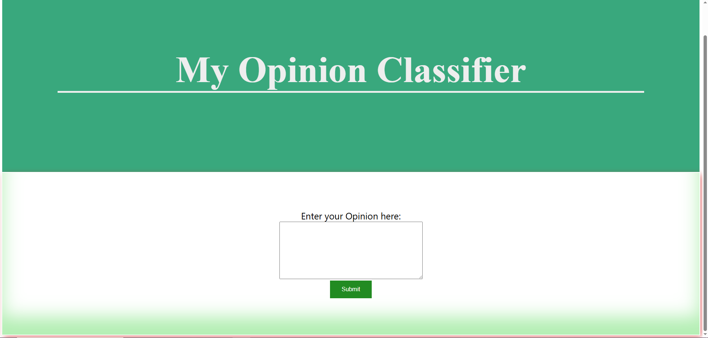

## My Opinion classifier

This app web classifies an opinion by telling whether it is positive or negative.
It uses a model that I trained with IMDB datas.



I used the Framework **Flask** for the Backend, **scikit-learn**, **pandas**, **TfidfVectorizer** and **LogisticRegression** to train my model and for the Frontend I used **HTML** and **CSS**.

# How to access
```bash
git clone https://github.com/Famous2705/opinion-classifier.git
cd opinion-classifier
python -m venv venv
source venv/bin/activate  # or venv\Scripts\activate on Windows
pip install -r requirements.txt
python server.py ```

# 📊 Model Performance
| Metric     | Score |
|------------|------|
| Accuracy   | 0.88 |
| Precision  | 0.88 |
| Recall     | 0.88 |
| F1-score   | 0.88 |
